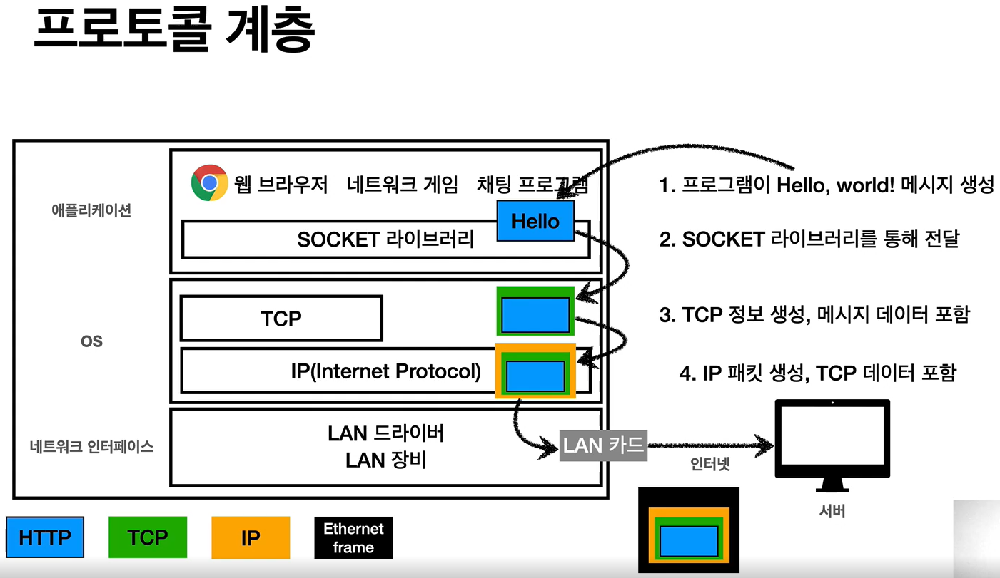
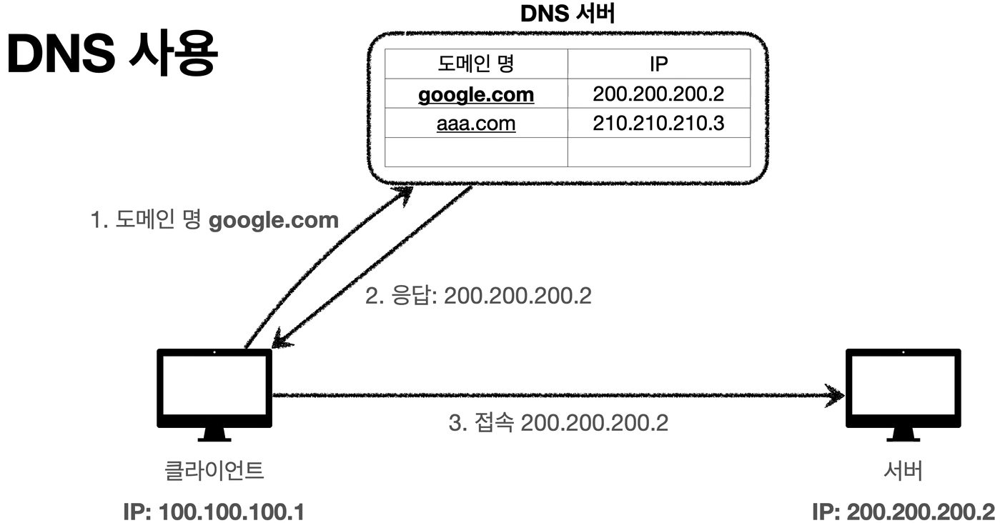
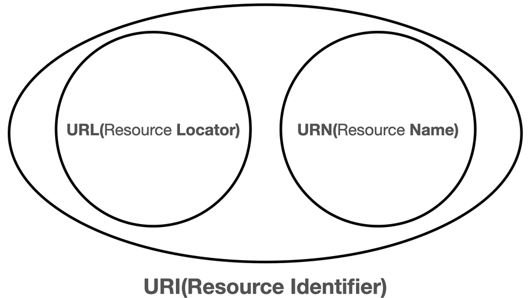
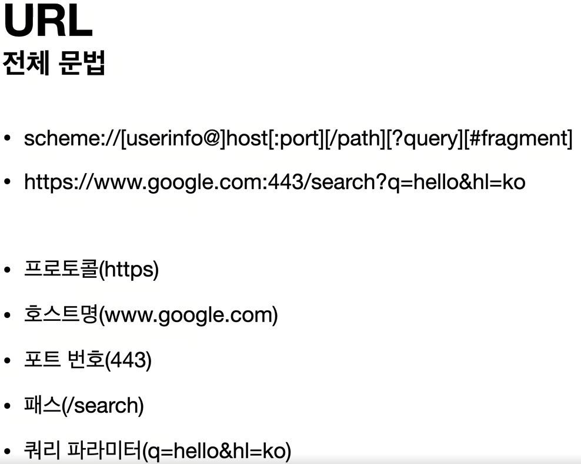
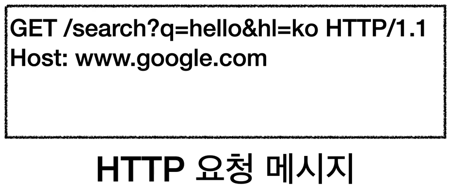
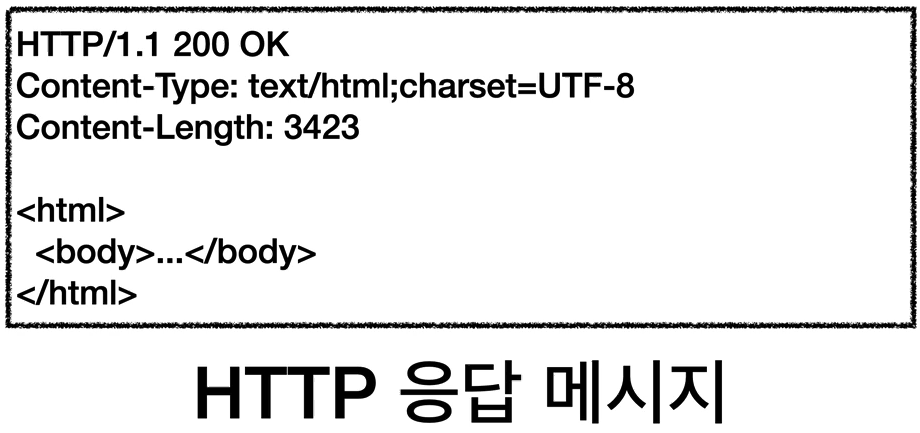
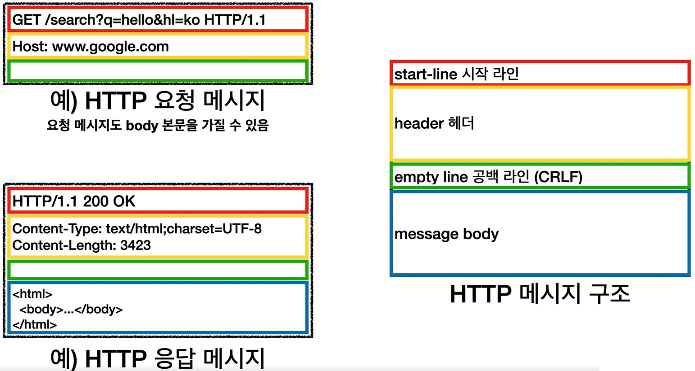

# 모든 개발자를 위한 HTTP 웹 기본 지식

### 1. 인터넷 네트워크

#### 1-1 인터넷 통신

#### 1-2 IP(인터넷 프로토콜)

IP 프로토콜의 한계

- 비연결성
  - 패킷을 받을 대상이 없거나 서비스 불능 상태여도 패킷 전송(TCP 3 way handshake)
- 비신뢰성
  - 중간에 패킷이 사라지면?
  - 패킷이 순서대로 안오면?
- 프로그램 구분
  - 같은 IP를 사용하는 서버에서 통신하는 애플리케이션이 둘 이상이면?(PORT로 구분)

$\to$ TCP로 해결

#### 1-3 TCP, UDP

IP 패킷 정보 : 출발지 IP, 목적지 IP, 기타...

TCP 패킷 정보 : 출발지 PORT, 목적지 PORT, 전송 제어, 순서, 검증 정보...

UDP : 기능은 별로 없지만 단순하고 빠름

#### 1-4 PORT

PORT - 같은 IP 내에서 프로세스 구분

0 ~ 65535 할당 가능

0 ~ 1023 : 잘 알려진 포트, 사용하지 않는 것이 좋음

#### 1-5 DNS

#### 2. URI와 웹 브라우저 요청 흐름

#### 2-1 URI

URN은 거의 안쓰이고 URL과 URI는 거의 같은 의미로 쓰임

#### 2-2 웹 브라우저 요청 흐름

1. URL 요청

2. DNS 조회(IP, PORT)

3. HTTP 요청 메세지 생성

   

4. SOCKET 라이브러리를 통해 OS로 전달

5. TCP/IP 패킷 생성(HTTP 메세지 포함)

6. 서버로 요청 패킷 전달

7. 서버에서 HTTP 메세지 파싱

8. HTTP 응답 메세지 생성

   

9. 클라이언트로 응답 패킷 전달

10. 클라이언트에서 HTTP 응답 메세지 파싱

11. 웹 브라우저 HTML 렌더링

#### 2-3 모든 것이 HTTP

HTTP(HyperText Transfer Protocol) : HTML, TEXT 뿐만 아니라 IMAGE, 음성, 영상, 파일, JSON, XML 등 거의 모든 형태의 데이터 전송 가능

HTTP/1.1 : 가장 많이 사용, 우리에게 가장 중요한 버전

HTTP/2 : 성능 개선

HTTP/3 진행중 : TCP 대신 UDP 사용, 성능 개선

#### 2-4 클라이언트 서버 구조

#### 2-5 Stateful, Stateless

최대한 stateless로 설계하고 어쩔수없는 부분(로그인 등)만 stateful로 설계

#### 2-6 비 연결성(connectionless)

#### 2-7 HTTP 메시지

### 3. HTTP 메서드

#### 3-1 HTTP API를 만들어보자

#### 3-2 HTTP 메서드 - GET, POST

GET 요청은 캐싱을 해서 조회는 웬만하면 GET으로

POST

- 새 리소스 생성(등록)
- 요청 데이터 처리
- 다른 메서드로 처리하기 애매한 경우

#### 3-3 HTTP 메서드 - PUT, PATCH, DELETE

PUT : 리소스가 있으면 대체, 없으면 생성

PATCH : 리소스 부분 변경(PUT은 완전히 대체해버림 부분변경 x)

DELETE : 리소스 삭제

#### 3-4 HTTP 메서드의 속성

안전(Safe) : 호출해도 리소스를 변경하지 않는다

멱등(Idempotent) : 한 번 호출하든 두 번 호출하든 몇 번 호출하든 결과가 똑같다

- GET (o)
- PUT (o)
- DELETE (o)
- POST (x)
- 서버에서 응답이 없을 때 같은 요청을 다시 보내도 되는지에 대한 판단의 근거

캐시가능(Cacheable)

- 응답 결과 리소스를 캐시해서 사용해도 되는가?

- GET, HEAD, POST, PATCH 캐시가능
- 실제로는 GET, HEAD 정도만 캐시로 사용
- POST, PATCH는 본문 내용까지 캐시 키로 고려해야 하는데, 구현이 쉽지않음