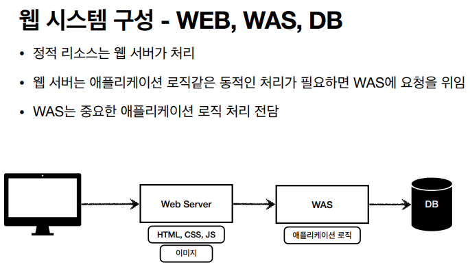
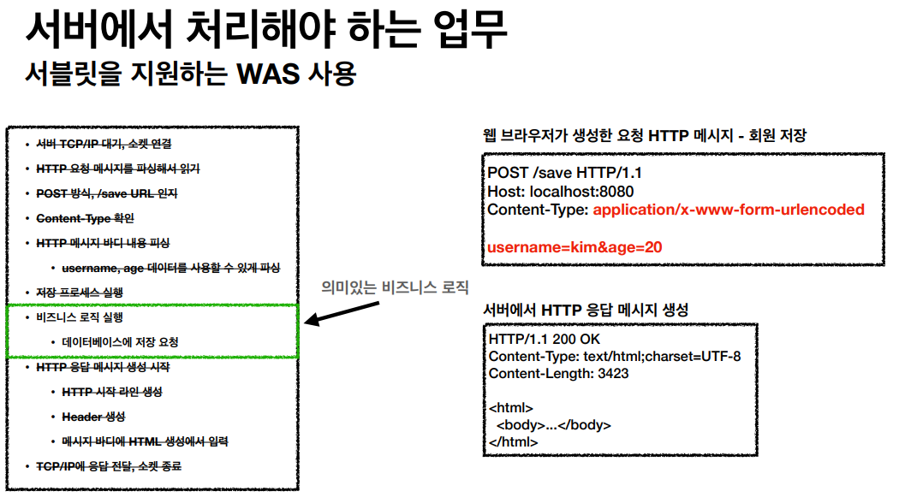
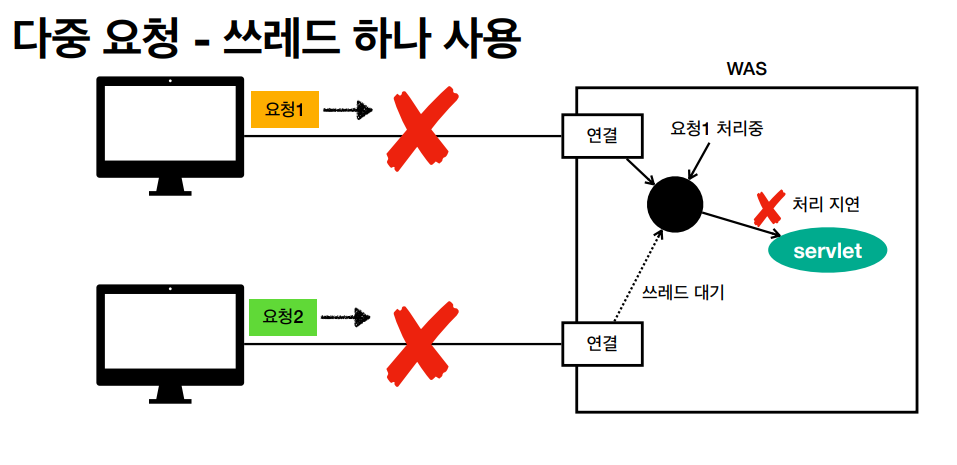
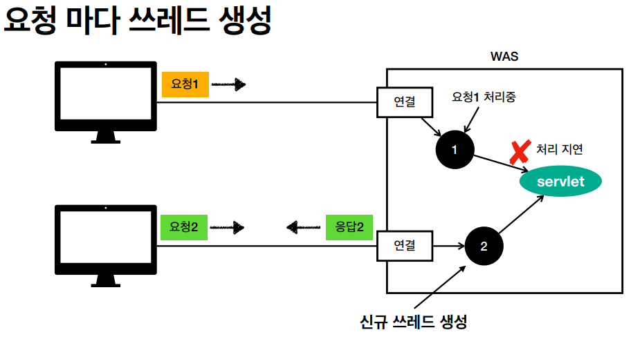
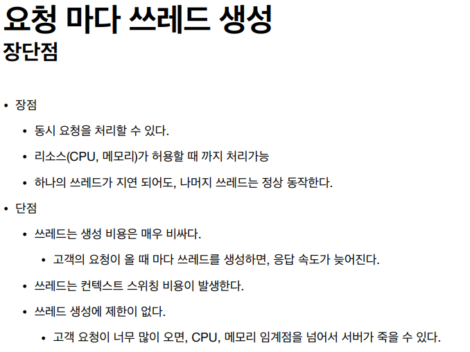
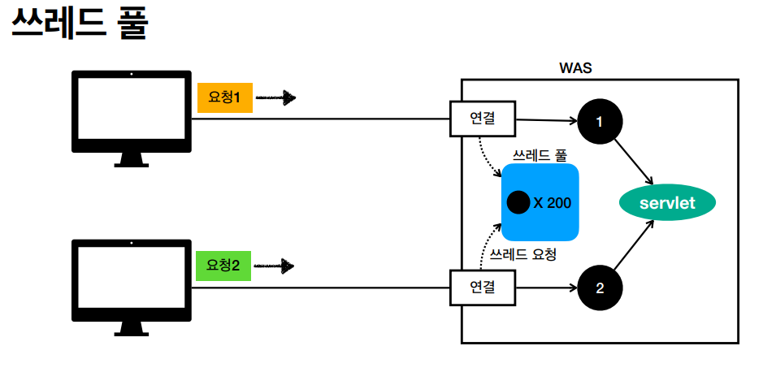
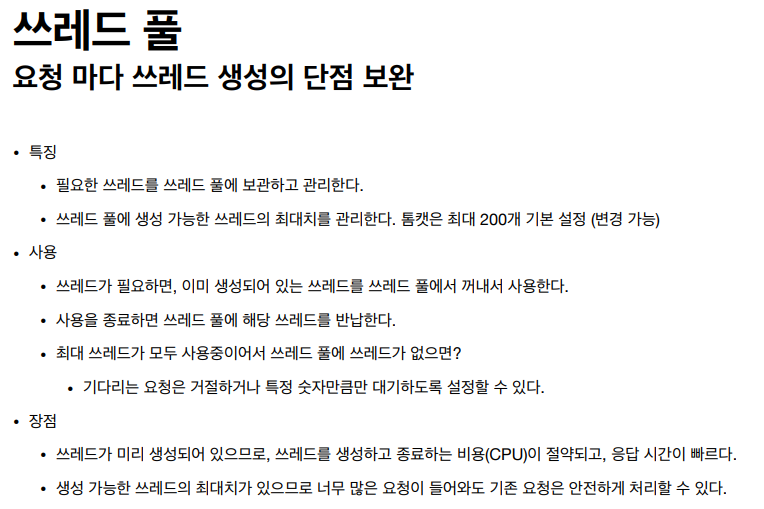
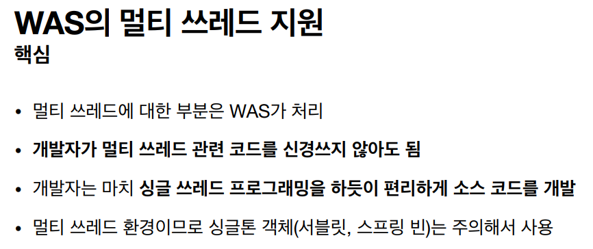

# 스프링 MVC 1편 - 백엔드 웹 개발 핵심 기술

### 1. 웹 애플리케이션 이해

#### 1-1 웹 서버, 웹 애플리케이션 서버

웹 서버 : 정적 리소스 제공(HTML, CSS, JS, 이미지, 영상 등)

웹 애플리케이션 서버(WAS) : 웹 서버 기능 + 프로그램 코드를 실행해서 애플리케이션 로직 수행

[클라이언트 - 웹 서버 - WAS - DB] 로 구축하면 장점이 많음

api 서버는 WAS만 해도 괜찮다

#### 1-2 서블릿

서블릿 : 의미있는 비즈니스 로직을 제외한 부분을 처리해줌

#### 1-3 동시 요청 - 멀티 쓰레드

#### 1-4 HTML, HTTP API, CSR, SSR

백엔드 서버가 응답하는 데이터의 종류

1. 정적 리소스
2. 동적인 HTML 페이지
3. HTTP API

#### 1-5 자바 백엔드 웹 기술 역사

### 2. 서블릿

#### 2-1 프로젝트 생성

#### 2-2 Hello 서블릿

#### 2-3 HttpServletRequest - 개요

HttpServletRequest 역할 : HTTP 요청 메시지를 개발자가 직접 파싱해서 사용해도 되지만, 매우 불편할 것이다. 서블릿은 개발자가 HTTP 요청 메시지를 편리하게 사용할 수 있도록 개발자 대신에 HTTP 요청 메시지를 파싱한다. 그리고 그 결과를 HttpServletRequest 객체에 담아서 제공한다.

#### 2-4 HttpServletRequest - 기본 사용법

#### 2-5 HTTP 요청 데이터 - 개요

1. GET - 쿼리 파라미터
2. POST - HTML Form
3. HTTP message body에 데이터를 직접 담아서 요청
   - JSON, XML, TEXT

#### 2-6 HTTP 요청 데이터 - GET 쿼리 파라미터

#### 2-7 HTTP 요청 데이터 - POST HTML Form

#### 2-8 HTTP 요청 데이터 - API 메세지 바디 - 단순 텍스트

#### 2-9 HTTP 요청 데이터 - API 메세지 바디 - JSON

#### 2-10 HttpServletResponse - 기본 사용법

#### 2-11 HTTP 응답 데이터 - 단순 텍스트, HTML

1. 단순 텍스트 응답
2. HTML 응답
3. HTTP API - MessageBody JSON 응답

#### 2-12 HTTP 응답 데이터 - API JSON

#### 2-13 정리

### 3. 서블릿, JSP, MVC 패턴

#### 3-1 회원 관리 웹 애플리케이션 요구사항

#### 3-2 서블릿으로 회원 관리 웹 애플리케이션 만들기

서블릿으로 응답해줄 html 만드는게 매우 번거로워서 템플릿 엔진을 사용(JSP, Thymeleaf 등)

#### 3-3 JSP로 회원 관리 웹 애플리케이션 만들기

JAVA 코드, 데이터를 조회하는 리포지토리 등등 다양한 코드가 모두 JSP에 노출되어 있다.  JSP가 너무 많은 역할을 한다. 이렇게 작은 프로젝트도 벌써 머리가 아파오는데, 수백 수천줄이 넘어가는 JSP를 떠올려보면 정말 지옥과 같을 것이다. (유지보수 지옥 썰)

그래서 MVC 패턴을 사용하게 된다.

#### 3-4 MVC 패턴 - 개요

#### 3-5 MVC 패턴 - 적용

#### 3-6 MVC 패턴 - 한계

### 4. MVC 프레임워크 만들기

#### 4-1 프론트 컨트롤러 패턴 소개

#### 4-2 프론트 컨트롤러 도입 - v1

#### 4-3 View 분리 - v2

#### 4-4 Model 추가 - v3

#### 4-5 단순하고 실용적인 컨트롤러 - v4

#### 4-6 유연한 컨트롤러1 - v5

#### 4-7 유연한 컨트롤러2 - v5

### 5. 스프링 MVC - 구조 이해

#### 5-1 스프링 MVC 전체 구조

**동작 순서**

1. **핸들러 조회**: 핸들러 매핑을 통해 요청 URL에 매핑된 핸들러(컨트롤러)를 조회한다.
2. **핸들러 어댑터 조회**: 핸들러를 실행할 수 있는 핸들러 어댑터를 조회한다.
3. **핸들러 어댑터 실행**: 핸들러 어댑터를 실행한다.
4. **핸들러 실행**: 핸들러 어댑터가 실제 핸들러를 실행한다.
5. **ModelAndView 반환**: 핸들러 어댑터는 핸들러가 반환하는 정보를 ModelAndView로 변환해서 반환한다. 
6. **viewResolver 호출**: 뷰 리졸버를 찾고 실행한다. JSP의 경우: InternalResourceViewResolver 가 자동 등록되고, 사용된다.
7. **View 반환**: 뷰 리졸버는 뷰의 논리 이름을 물리 이름으로 바꾸고, 렌더링 역할을 담당하는 뷰 객체를 반환한다. JSP의 경우 InternalResourceView(JstlView) 를 반환하는데, 내부에 forward() 로직이 있다.
8. **뷰 렌더링**: 뷰를 통해서 뷰를 렌더링 한다.

#### RequestMapping

**클래스 레벨** @RequestMapping("/springmvc/v2/members")

- **메서드 레벨** @RequestMapping("/new-form") &rarr; /springmvc/v2/members/new-form

- **메서드 레벨** @RequestMapping("/save") &rarr; /springmvc/v2/members/save

- **메서드 레벨** @RequestMapping &rarr; /springmvc/v2/members

